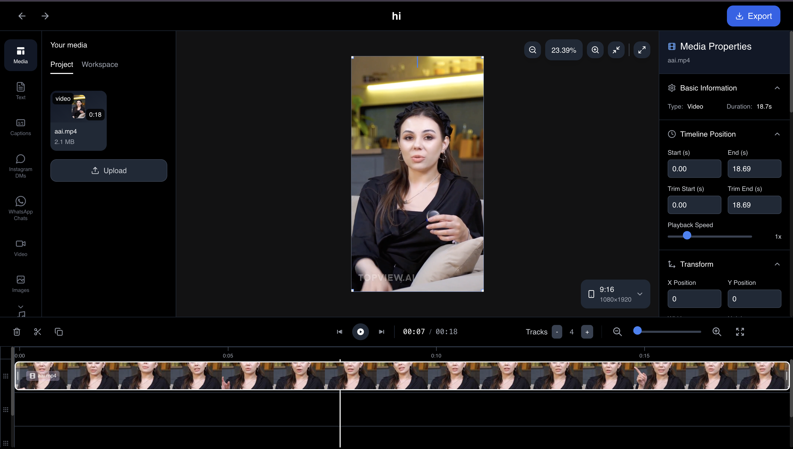

# Klippy — Browser‑Based Video Editor

https://github.com/user-attachments/assets/6ae103df-bc3f-44a7-97d6-1c26e3571935

Klippy is a fast, modern, and privacy‑friendly video editor that runs entirely in your browser. It uses Remotion for real‑time preview and FFmpeg.wasm for high‑quality local exports — no uploads, no accounts, no watermarks.

## 🔗 Links

- **Full Code Access:** [https://www.klippy.pro/](https://www.klippy.pro/)
- **Discord Community:** [https://discord.gg/xJVXbQVPZP](https://discord.gg/xJVXbQVPZP)
- **Buy Latest Codebase:** [https://www.klippy.pro/pricing](https://www.klippy.pro/pricing)

Edit multi‑track timelines, add text, captions, chat overlays, transitions, and export up to 1080p directly from your machine.

– Home: `app/page.tsx`
– Projects: `app/(pages)/projects`
– Editor: `app/(pages)/projects/[id]`

**Why Klippy?** Your media never leaves your device. Everything (projects and files) is stored locally via IndexedDB, and rendering happens in your browser using WebAssembly.

## Features

- Real‑time preview with Remotion player
- Multi‑track timeline with zoom, snap, and rows
- Drag/move/resize timeline items (react‑moveable)
- Split, duplicate, delete directly from timeline
- Import videos, audio, images and add text layers
- Advanced text controls (font, size, color, opacity, stroke, shadow, animations)
- Captions authoring (SRT/VTT parsing/rendering) with timeline integration
- Social overlays: Instagram/WhatsApp conversation renderers
- Transitions between clips (fade/slide/wipe/zoom/blur)
- High‑quality export using FFmpeg.wasm (MP4/WebM/GIF)
- Advanced export path with canvas compositor (transparency/chroma key)
- Project management (create/list/delete) persisted in IndexedDB
- Dark UI with Tailwind, Radix UI, and Lucide icons

## Tech Stack

- Next.js 14 (App Router) + React 18 + TypeScript
- Tailwind CSS + Radix UI + Lucide icons
- Remotion `@remotion/player` for preview
- FFmpeg.wasm (`@ffmpeg/ffmpeg`, `@ffmpeg/util`) for exports
- Redux Toolkit + React‑Redux for state
- IndexedDB via `idb` for local file/project storage
- `react-moveable` for on‑canvas/timeline interactions

## Requirements

- Node.js 18.17+ and npm 9+
- A modern desktop browser with WebAssembly support (Chrome/Edge recommended)
- Sufficient RAM/CPU for rendering (FFmpeg.wasm is CPU‑intensive)

Note: FFmpeg core is loaded from a CDN (`unpkg`) at runtime; an internet connection is required the first time it loads.

## Getting Started

1) Install dependencies

`npm install`

2) Start the dev server

`npm run dev`

3) Open the app

`http://localhost:3000`

– Create a project at `/projects`, then open it to start editing.

### Production Build

- Build: `npm run build`
- Start: `npm start`

## Using The Editor

1) Create a project
- Choose a preset (YouTube, TikTok, Instagram, etc.) or custom size.

2) Import media
- Drag and drop video/audio/images. Files are stored locally in IndexedDB; nothing is uploaded.

3) Edit on the timeline
- Move, trim, split, duplicate, and arrange layers across multiple rows.
- Add text and captions; adjust properties like position, opacity, z‑index, font, stroke, shadow, and animations.
- Add transitions between clips.

4) Preview
- Remotion player provides smooth, real‑time preview; use the custom timeline to scrub/play.

5) Export
- Click Export in the header and choose:
  - Standard export (FFmpeg.wasm): MP4, WebM, or GIF up to 1080p.
  - Advanced export (Canvas): Supports transparency, chroma key, text/captions/overlays with better fidelity for composites.

## Keyboard Shortcuts

- Space: Play/Pause
- Arrow Left/Right: Move playhead (hold Shift for 10s jumps)
- Home/End: Jump to start/end
- S: Split at playhead (when an item is active and under playhead)
- D: Duplicate selected item
- Delete/Backspace: Delete selected item
- Ctrl/Cmd+Z / Ctrl/Cmd+Shift+Z: Undo/Redo (placeholders in UI today)

## Exporting

- FFmpeg.wasm is loaded dynamically; first use may take a moment.
- MP4 uses H.264 + AAC with configurable CRF/preset via `exportSettings`.
- WebM/GIF are available; transparent WebM alpha is best handled with the Advanced (Canvas) exporter.
- Advanced exporter includes chroma key (green screen), chat overlays, and text/captions composited on a canvas, then encoded.

## Data & Privacy

- Projects and media files are stored locally in IndexedDB (`app/store/index.ts`).
- Clearing browser storage will remove your projects and cached files.
- No data leaves your machine unless you explicitly export/download.

## Browser Support & Limitations

- Chrome/Edge recommended for performance and FFmpeg.wasm stability.
- Safari support varies for WebAssembly and may be slower.
- Long/large exports require memory and CPU; consider shorter segments.
- Transparent videos and complex composites render best via the Advanced exporter.

## Project Structure

- `app/(pages)/projects` — projects list and creation flow
- `app/(pages)/projects/[id]` — the editor (timeline, panels, preview)
- `app/components/editor` — editor UI (timeline, panels, export modal)
- `app/components/editor/player` — Remotion player and composition
- `app/hooks` — hooks for export, timeline, keyframes, etc.
- `app/store` — Redux Toolkit store, slices, and IndexedDB helpers
- `app/utils` — fonts, captions, canvas renderers, transitions
- `public/` — static assets (fonts, icons)

## Development

- Lint: `npm run lint`
- Styling: Tailwind in `app/globals.css`, config in `tailwind.config.ts`
- Aliases: `@/*` path alias configured in `tsconfig.json`

## Contributing

- Issues and PRs welcome. Please keep changes focused and align with existing patterns.
- Before submitting a PR:
  - Run locally and validate exports
  - Keep UI consistent with Tailwind style used here
  - Avoid introducing unrelated changes

## Roadmap

- Undo/Redo history in UI
- Crop/position controls in timeline items and canvas
- Drag playhead directly on ruler
- Import/Export project format
- Docker image for self‑hosting
- Audio tools (separate audio, playback speed)
- Responsive layout for phones
- Shapes/effects for elements; more text animations
- PWA mode for offline editing

See inline TODOs across the codebase for more details.

## License

This project uses a dual license:

- Open Source: GNU AGPL v3 (see `LICENSE-AGPL3`)
- Commercial: For closed‑source or commercial use without AGPL obligations, contact the author for a commercial license: `jayakumarmagesh@gmail.com`

Network/SaaS use triggers AGPL obligations to provide corresponding source to users interacting over a network. See `LICENSE` for details.

## Acknowledgements

- Remotion (`@remotion/player`)
- FFmpeg.wasm (`@ffmpeg/ffmpeg`, `@ffmpeg/util`)
- Tailwind CSS, Radix UI, Lucide Icons
- react‑moveable, idb, Redux Toolkit
